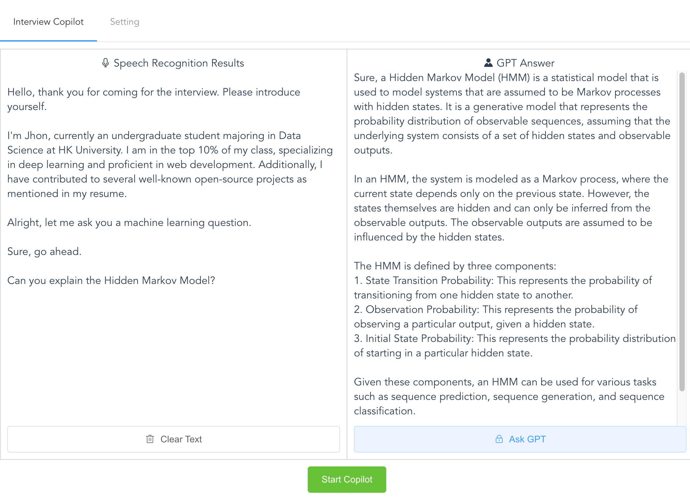

> For Chinese users, we have provided an improved version: [https://mszl.me ](https://mszl.me )
> 
> （对于中国地区用户，我们提供了一个优化版本：[https://mszl.me ](https://mszl.me ) ）: 

# Interview Copilot

> Utilizing GPT and Microsoft Azure's cutting-edge technology to assist interviewers

**Online Demo:** https://interview-copilot.github.io

Interview Copilot is a web application that captures audio from the microphone, 
utilizes Microsoft Azure's speech recognition service to obtain transcript, 
and then invokes GPT to generate answer.

## Why Interview Copilot?

Although there are excellent interview assistance programs on GitHub (like [cheetah](https://github.com/leetcode-mafia/cheetah)), 
they can only run on specific desktop platforms and are difficult to install or extend.

Therefore, I developed Interview Copilot using pure web technology.
It does not need installation and can run in the browser of desktop, tablet, or smartphones.
Also, It is **serverless**, the API Token information is stored locally in your browser.

|                                                      | Windows | Mac  | Pad \ Phone |
| ---------------------------------------------------- | ------- | ---- | ----------- |
| [cheetah](https://github.com/leetcode-mafia/cheetah) |         | ✅    |             |
| [ecoute](https://github.com/SevaSk/ecoute)           | ✅       |      |             |
| Interview Copilot                                    | ✅       | ✅    | ✅           |

## Setting Instruction

In order to use GPT, you need an Open AI API Token: https://platform.openai.com

To use Azure's speech recognition service, you can apply for a free token by referring to [this tutorial](./docs/azure_speech_service_tutorial.md).

## Developing
This project is based on Vue2. Just  `cd app`:

**install packages:** `npm install`

**develop:** `npm run serve`

**build:** `npm run build`
